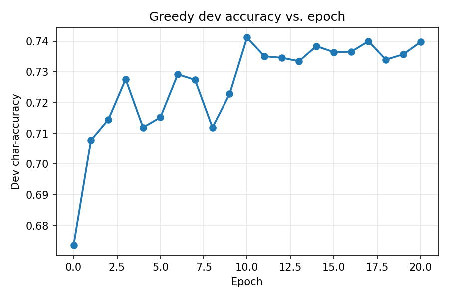

# CDCL Structured OCR/POS

### SAT‑Based Structured Prediction for OCR
This repository implements a weighted Max‑SAT decoder for optical character recognition (OCR), combining an averaged structured perceptron for parameter learning with an off‑the‑shelf Max‑SAT solver (RC2). Two heuristics—transition pruning and score‑based candidate reduction—make inference practical at >3 words/s on commodity hardware.

- Greedy / Viterbi (fast, baseline)

- CNF + Max‑SAT decoding (exact, supports hard/soft constraints)

Recent additions (Jun 2025) include:

- Pruned SAT decoder (src/sat_infer.py) — skips low‑impact transitions and low‑probability labels for 10‑200× speed‑ups.

- Position‑window features (window = 5, feat_dim = 730)

- Data‑imbalance handling via DUP_CAP and z‑score normalisation.


### Learning Curve



## Installation
Tested on Python 3.10 + macOS 13: 
```
python -m venv venv && source venv/bin/activate
pip install -r requirements.txt
```

## Repo Structure
cdcl_struct_ocr/
├── src/
│   ├── train.py             # Main training script (perceptron + greedy/SAT decoding)
│   ├── train_crf.py         # CRF baseline training script
│   ├── dataset.py           # Data loading and preprocessing
│   ├── models.py            # Structured perceptron implementation
│   ├── sat_infer.py         # Max‑SAT decoder (RC2 wrapper)
│   └── cnf_encoder.py       # CNF encoding utilities
├── tests/
│   ├── greedy_eval.py       # Greedy/Viterbi evaluation on dev set
│   └── sat_eval.py          # SAT‑based evaluation on dev set
├── plot/
│   └── plot_dev.py          # Plot dev‑accuracy & throughput curves
├── experiments/
│   ├── dev_acc_history.npy  # Recorded dev accuracy per epoch
│   ├── wps_history.npy      # Recorded throughput per epoch
│   ├── final_W.npy          # Learned unary weights
│   ├── final_T.npy          # Learned bigram matrix
│   └── crf_model.pkl        # Pickled CRF model
├── results_register.json    # Aggregated results for ablation studies
├── merge_results.py         # Script to merge new results into registry
├── docs/
│   └── dev_accuracy.png     # Generated accuracy plot
├── README.md                # This file
└── LICENSE                  # MIT License


## Usage 
### 1. Train
- Greedy:
    ```
    PYTHONPATH=$PWD python -m src.train \
        --n_train 2500 \
        --window 5 \
        --feat_dim 720 \
        --epochs 25 \
        --lr 0.15
        --hist_out experiments/dev_acc_history.npy \
        --wps_out experiments/wps_history.npy
    ```
- with SAT decoing at test time:
    ```
    PYTHONPATH=$PWD python -m src.train \
        --n_train 2500 \
        --window 5 \
        --feat_dim 720 \
        --epochs 25 \
        --lr 0.15
        --sat_test
    ```
### 2. Greedy / Viterbi evaluation
To run greedy/viterbi evaluation:
```
PYTHONPATH=$PWD python tests/greedy_eval.py \
    --weights submission/final_W.npy \
    --n_train 2500 --window 5 --feat_dim 720
```
### 3. SAT Decoder
To run sat evaluation:
```
PYTHONPATH=$PWD python tests/sat_eval.py \
    --weights submission/final_W.npy \
    --bigrams submission/final_T.npy \
    --n_train 2500 --window 5 --feat_dim 720
```
### 4. Train CRF
```
python src/train_crf.py \
    --n_train 2500 --window 5 --max_iter 150
```

## Plot
- 1. plot dev-accuracy curve  (already in place)
```
python plot/plot_dev.py \
  --hist experiments/dev_acc_history.npy \
  --wps experiments/wps_history.npy \
  --out docs/dev_accuracy_wps.png
```
- 2. generate t-SNE scatter
```
python plot/plot_tsne.py --csv data/raw/letter.data.gz \
                         --out docs/char_tsne.pdf
```
- 3. merge_results
```
PYTHONPATH=$PWD python merge_results.py \
      --registry results_register.json \
      --crf_acc 0.6481
```

## Algorithm details
- Unary features — 112 image pixels + 16 handcrafted statistics per letter, concatenated over a context window (window×feat_dim).  A bias term is appended automatically.

- Bigram matrix T — learned by perceptron updates; rewards frequent letter pairs.

- SAT formulationVariables v_{i,l} (choose label l at pos i) and optional z_{i,l,q} (choose bigram l→q)
    - Hard clauses: exactly‑one per position; linking z → v.
    - Soft clauses: maximise unaries & bigram rewards (converted to costs for RC2).
    - Pruning: skip transitions T[l,q] < T_max − τ (τ = 2.0 by default).

See results_register.json for the full registry of runs. Key findings:

- Default (w=5, n=2500, d=720): Dev accuracy = 0.741, throughput ≈ 4980 w/s

- Window size: 3→5 improves accuracy; 7 slows down without gains

- Train size: 1k→2.5k helps; 4k overfits and drops performance

- Feature dim: increasing beyond 720 offers no accuracy gain

- Duplicate cap: capping at 20 maximizes accuracy

- CRF baseline: 0.648 accuracy, decoding speed orders-of-magnitude slower

- SAT decoding: boosts greedy from 0.665→0.741; unary+bigram → 0.728

- Plots in docs/ illustrate accuracy vs. epoch and throughput trade-offs.


## License

MIT License — see LICENSE file.

## Contact

G. Kim  ·  gkim@ucsd.edu   ·  COGS 185 Spring 2025


